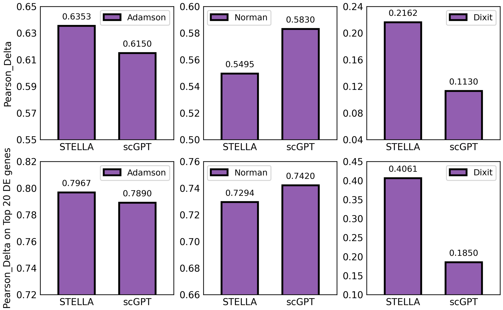

# STELLA

- Pre-training a Large Single-Cell RNA Model from Scratch for Educational Purposes.

### 🎉 0. Introduction

- Data:
  - Input: gene symbol sequence and gene expression sequence. (added)
  - Preprocess: normalize_total (1e4) and log1p, then globally divided into 100 bins using tdigest algorithm.
- Model Architecture:
  - Transformer with DeepSeekMoE.
- Pretraining Task:
  - Masked Language Modeling (MLM). (Just like scBERT)

### ⚙️ 1. Environment Configuration

```bash
conda create -y -n stella python=3.10
conda activate stella

pip install notebook ipywidgets

# CUDA 12.4
pip install torch==2.4.0 torchvision==0.19.0 torchaudio==2.4.0 --index-url https://download.pytorch.org/whl/cu124

# transformers<=4.49.0
pip install transformers==4.49.0 datasets evaluate accelerate peft tensorboard
pip install deepspeed

pip install scanpy igraph leidenalg gseapy joblib tdigest

# Perturbation Prediction Tutorial Needed!
pip install torch_geometric
```

### 🧑🏻‍💻 2. Scripts

- Pretrain: `src/wanglab_workflow`

```bash
# bash
cd src/wanglab_workflow
sh pretrain.sh

# slurm
cd src/wanglab_workflow
sbatch submit.sh
```

-  Downstream Tasks: `tutorials`
  - Cell Type Annotation
  - Gene Regulatory Network Inference (GRN)
  - Genetic Perturbation Prediction

### 📚 3. Results Overview

- <u>**Cell Type Annotation & GRN**</u>


- <u>**Genetic Perturbation Prediction**</u>

<p align="center">
  
</p>

### 💕 4. Acknowledgement

- Huggingface
- scBERT
- Geneformer